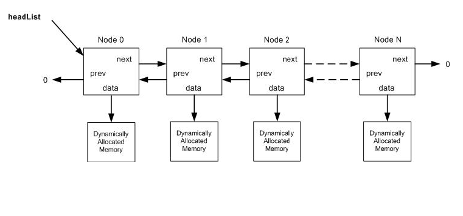

##上海维塔士面试题  
考试时间: 1.5 小时  

###问题 1  
####主题:C++ 与 类(Class)  

#####1.a. 你有一份简单的BankCustomer类的代码， 请写出下面函数的声明(Declaration) (不需要实现): (10 分)  

拷贝构造函数 (copy constructor)  
BankCustomer(const BankCustomer& other){};  
“=”操作符重载 (= operator)  
BankCustomer &operator = (const BankCustomer& other){};  
“= =”操作符重载 (= = operator)  
bool operator == (const BankCustomer& other){};  
“+” 操作符重载 (+ operator)  
BankCustomer operator+(const BankCustomer& other){};  

#####1.b. 为类Iobject, Vehicle, Plane, Car添加并实现构造函数 (Constructors)，析构函数 (Destructors)和拷贝构造函数 (Copy Constructors). (20 分)  
添加下列函数和成员变量到相应的类并且实现他们，请考虑多态性(polymorphism):  
```
	int mMaxPassengers;
	float mMaxSpeed;
	float mMaxWeight;

	getMaxPassengers
	getMaxSpeed
	getMaxWeight
	isLandVehicle
```
可用: 已经提供下列头文件(header file)和类(class)  

|class IObject{<br>public:<br>};|text2class Vehicle : IObject{<br>public:<br>};|class Car : public Vehicle{<br>public:<br>};|class Plane : public Vehicle{<br>public:<br>};|
|-|


```
class IObject {
public:
    IObject(){}
    IObject(const IObject& other){}
    ~IObject(){}
};


class Vehicle : IObject {
public:
    Vehicle():
            mMaxPassengers(0), mMaxSpeed(0), mMaxWeight(0){}
    Vehicle(int passengers, float speed, float weight):
            mMaxPassengers(passengers), mMaxSpeed(speed), mMaxWeight(weight){}
    Vehicle(const Vehicle& other) {
        this->mMaxWeight = other.mMaxWeight;
        this->mMaxSpeed = other.mMaxSpeed;
        this->mMaxPassengers = other.mMaxPassengers;
    }
    ~Vehicle(){}

    int getMaxPassengers() const {
        return mMaxPassengers;
    }

    float getMaxSpeed() const {
        return mMaxSpeed;
    }

    float getMaxWeight() const {
        return mMaxWeight;
    }

    virtual bool isLandVehicle() = 0;

protected:
    int mMaxPassengers;
    float mMaxSpeed;
    float mMaxWeight;
};

class Car : public Vehicle {
public:
    Car() : Vehicle(){}
    Car(int passengers, float speed, float weight) :
            Vehicle(passengers, speed, weight){}
    Car(const Car& other) {
        this->mMaxPassengers = other.mMaxPassengers;
        this->mMaxSpeed = other.mMaxSpeed;
        this->mMaxWeight = other.mMaxWeight;
    }
    ~Car(){}


    bool isLandVehicle() {
        return true;
    }
};

class Plane : public Vehicle {
public:
    Plane() : Vehicle(){}
    Plane(int passengers, float speed, float weight) :
            Vehicle(passengers, speed, weight){}
    Plane(const Plane& other) {
        this->mMaxPassengers = other.mMaxPassengers;
        this->mMaxSpeed = other.mMaxSpeed;
        this->mMaxWeight = other.mMaxWeight;
    }
    ~Plane(){}


    bool isLandVehicle() {
        return false;
    }
};
```
###问题 2  
####主题:		C++ 与 逻辑  

#####2.a 请根据下面Bar()函数选择正确的答案: (8 分)  
```
class Foo
{
void Bar( void ) const;
};
```
######2.a.1. Bar() 函数的访问类型(Access Type)是什么?	D   
A. public	  B. protected		    C. package			D. private  
######2.a.2. Bar() 函数的返回类型(Return Type)是什么? C  
A. void		  B. void const		C.没有返回值		D. 以上皆否  
######2.a.3. Bar() 函数的参数列表是什么? A    
A. 无参数	     B. 一个名为void的参数		C. 一个匿名参数, 类型为void    D. 以上皆否  
######2.a.4. 在Bar() 函数声明中，关键词const是什么意思? B  
A. Bar 返回一个const类型			B. Bar函数不能改变Foo类的成员变量  
C. 子类不能重载Bar				D. Bar 总是为相同的参数列表返回相同的值  


#####2.b 阅读下列代码并回答问题: (8 分)
```
class Base { /* …. */ };
class Sub : public Base { /* …. */ };
void Transmogrify( Base obj ) { //.. change something in obj .. }
void Transubstantiate( Base& obj)
{
	Transmogrify( obj );
}
	void main()
{
	Sub d;
	Transubstantiate( d );
}
```
上述代码运行时会产生什么结果 ? 请从下面列表中选择答案并排序。  
A.	在全局命名空间中声明Base类 (Declare class Base in global namespace)  
B.	Base类的默认构造函数被调用 (Default constructor of class Base is called)  
C.	Base类的拷贝构造函数被调用 (Copy constructor of class Base is called)  
D.	Base类的析构函数被调用 (Destructor of class Base is called)  
E.	在全局命名空间中声明Sub类 (Declare class Sub in global namespace)  
F.	Sub类的默认构造函数被调用 (Default constructor of class Sub is called)  
G.	Sub 类的拷贝构造函数被调用 (Copy constructor of class Sub is called)  
H.	Sub类的析构函数被调用 (Destructor of class Sub is called)  
I.	在全局命名空间中声明函数Transmogrify (Declare function Transmogrify in global namespace)  
J.	进入函数Transmogrify (Enter function Transmogrify)  
K.	离开函数Transmogrify (Leave function Transmogrify)  
L.	在全局命名空间中声明函数Transubstantiate (Declare function Transubstantiate in global namespace)  
M.	进入函数 Transubstantiate (Enter function Transubstantiate)  
N.	离开函数Transubstantiate (Leave function Transubstantiate)  
O.	在全局命名空间中声明main函数(Declare function main in global namespace)  
P.	进入函数main (Enter function main)  
Q.	离开函数main (Leave function main)  
R.	d被改变 (d is changed)  

AEILPBFMJRKNHQ  
#####2.c.	测量水(Measuring water) (5 points)  
如果你有无限量的水，有1个容量为5升的水桶和一个容量为3升的水桶，你如何精确的得到4升的水(If you had an unlimited supply of water, a 5 liter and a 3 liter bucket, how would you measure exactly 4 liter?)  

先将3升水倒入5升的水桶中。再用3升的水桶装水，将5升的水桶装满，3升的桶中将剩下1升水。将5升的水桶倒空，将这1升水装入其中，在用3升的水桶装3升水倒入5升的水桶中，即得到了4升的水。  

#####2.d.	果冻豆(Jelly beans) (5 points)  
如果你有一篮子的果冻豆，有些是红的，有些是蓝的，有些是绿的。你需要闭上眼，拿出两个相同颜色的果冻豆。你要拿多少个果冻豆才能保证有两个是相同颜色的？(You have a bucket of jelly beans. Some are red, some are blue, and some green. With your eyes closed, pick out 2 of the same color. How many do you have to take to be sure you have 2 of the same color?)  

至少要拿4个才能保证有两个是相同颜色的。前三次最差的情况是拿到三种不同颜色的果冻豆，故拿4个可以保证有两个是相同颜色的。
  
####问题 3:  
Topic:		C++ 与 数据结构  

#####3.a. 写一个函数，用来移除节点类型为LinkList的链表(Linked List)中的一个节点Write a function that removes a given node in a linked list container containing nodes of type LinkList. (10 分)  

假设每个LinkList节点和他们的数据指针(data pointer)是用malloc (C代码) 或new (C++代码)来动态分配的。  
实现时考虑健壮性和速度。  
```
typedef struct LinkList
{
	struct LinkList		*next;
	struct LinkList		*prev;
	struct ImportantData	*data;
} LinkList_t;
LinkList_t *headList; 
void DeleteNode(int pos) {
	if (pos < 0 || pos > GetLength()) {
		cout << “输入有误” << endl;
		return ;
	} else {
		LinkList_t *del_t, *p;
		p = headList;
		while (pos-- >1)
			p = p->next;;
		del_t = p->next;
		if (del_t ->next != NULL) 
		del_t ->next->prev = p;
		p->next = del_t ->next;
		delete del_t;
		del_t = NULL;
	}
}
```
#####3.b. 请描述std::vector<T>与std::list<T>的不同. (8 分)  
vector是连续存储结构，类似于数组，每个元素在内存上是连续的，支持高效的随机访问和在尾部插入与删除，而在其他位置上的插入与删除的效率较低。类似于数组。  

list是非连续存储结构，通过双链表实现的，每个元素都有一个前向指针一个后向指针，故支持前向和后向遍历。支持高效的随机插入和删除，而随机访问的效率较低。且要额外维护指针，开销较大。  

###Question 4
####主题:		综合

#####4.a. 说明下面代码的问题，并描述你会如何修正? (8 分)  
```
Object *p = new Object [10];
delete p;
```
p是一个对象数组的指针，所以执行delete p的时候，只会执行p[0]的析构函数，这样会导致析构不完全。  
修正：delete[] p;  

#####4.b. 写一个函数用来测试一个整数是否为2的次方(10 分)  
```
bool	IsPowerOf2(int inInteger)
{
	return !(inInteger & (inInteger - 1))
}
```

#####4.c.解释下面哪些声明可以成功编译，并指出常量是指针还是指针指向的值: (8 分)  

const char *  
char const *  
char * const  
######const char *  
可以成功编译，指针指向的值是常量。  
######char const *  
可以成功编译，同上。  
######char * const  
可以成功编译，指针是常量。  
